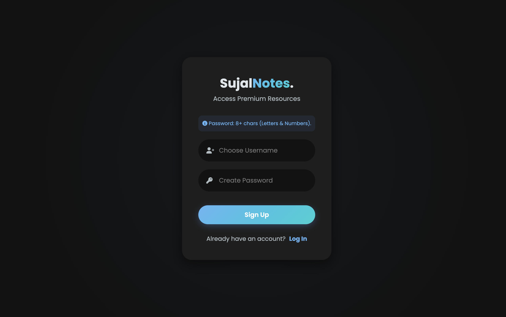
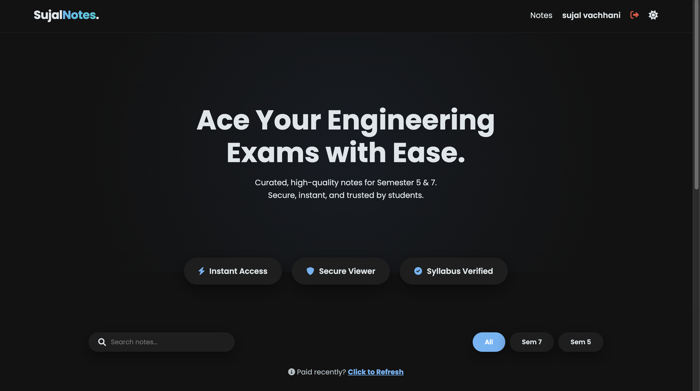
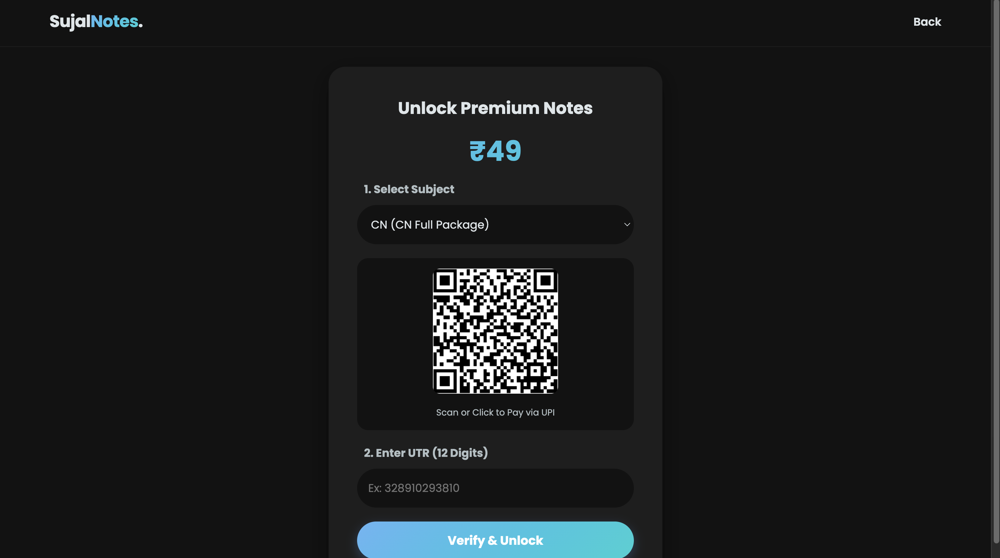
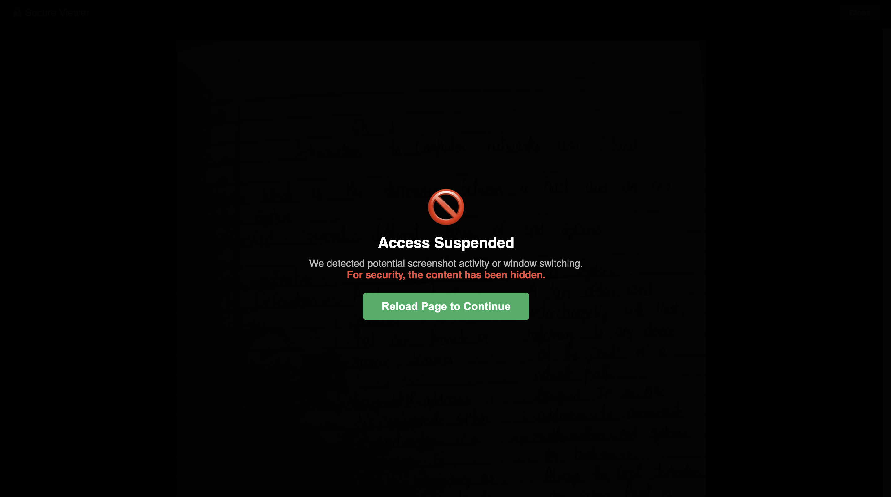
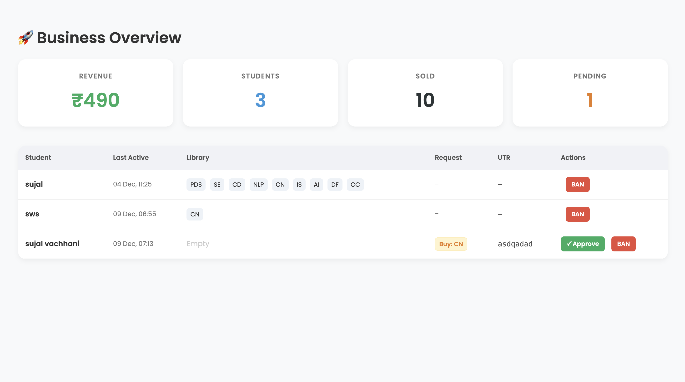

Here is your **complete, clean, production-ready `README.md`** including features, setup, screenshots section (with your secure viewer screenshot), and all required structure.

Just **copy–paste this into `README.md`** in your GitHub repo.

---

# 🚀 SujalNotes — Flask Edition

A secure, server-side rendered web application for sharing and monetizing engineering notes.
Built with **Flask**, **SQLite/Postgres**, **flask-login**, and a **protected PDF delivery system** that prevents unauthorized access.

---

## ✨ Key Features

### 🔐 Secure Authentication

* User registration & login using hashed passwords
* Session handling with `flask_login`
* Banned users are blocked from access

### 📁 Protected Notes System

* PDFs stored outside `/static` → cannot be publicly accessed
* Notes organized by semester (`sem5`, `sem7`)
* Only unlocked (paid) subjects become accessible

### 💳 Payment / UTR Verification

* Students submit UTR after scanning your UPI QR code
* Admin manually verifies & unlocks the subject

### 🛡️ Secure PDF Viewer

* Content delivered only after permission check
* Prevents direct URL access
* Includes **Screenshot Detection / Window Switching Blocker** (content auto-hides)

### 👮 Admin Dashboard

* Hidden admin route
* Approve payments
* Unlock subjects
* Ban users
* Track total users, revenue, pending verifications

---

## 📸 Screenshots

## 📸 Screenshots

### 📝 Sign Up / Login


### 🏠 Dashboard


### 💳 Payment & UTR Submission


### 🔒 Secure Viewer (Screenshot Protection)


### 🛡 Admin Panel


---


## 🗂 Project Structure

```
SujalNotes/
│
├── app.py
├── users.db (auto-created in local environment)
├── requirements.txt
│
├── protected_notes/
│   ├── sem5/
│   └── sem7/
│
├── templates/
│   ├── index.html
│   ├── login.html
│   ├── payment.html
│   ├── viewer.html
│   └── admin.html
│
└── static/
    ├── style.css
    └── qr_code.jpeg
```

---

## 🛠 Installation & Setup

### 1️⃣ Clone Repository

```bash
git clone https://github.com/<your-username>/SujalNotes.git
cd SujalNotes
```

### 2️⃣ (Optional) Create Virtual Environment

```bash
python -m venv venv
# Mac/Linux
source venv/bin/activate
# Windows
venv\Scripts\activate
```

### 3️⃣ Install Dependencies

```bash
pip install -r requirements.txt
```

### 4️⃣ Add Your Notes

Create folder structure:

```bash
mkdir -p protected_notes/sem5 protected_notes/sem7
```

Place your `.pdf` files inside these folders.

### 5️⃣ Run the Application

```bash
python app.py
```

Visit:
👉 `http://127.0.0.1:5000/`

---

## 🔑 User Flow (Students)

1. Register / Login
2. Browse all notes (locked & unlocked)
3. Select a locked subject → payment page
4. Scan UPI QR → pay → submit UTR
5. Wait for admin verification
6. Once approved → subject unlocks → PDF viewer opens

---

## 🛡️ Admin Flow

Access the admin dashboard:

```
/admin?secret=sujal123
```

Admin can:

* View all users
* Approve UTR → unlock subject
* Ban users (fake payments)
* View total sales, revenue
* Clear pending requests

**⚠️ CHANGE THE SECRET IN PRODUCTION**

---

## 🌐 Deployment Notes

### If `DATABASE_URL` is present:

* App automatically connects to Postgres (Render/Heroku)

### If not present:

* App uses local SQLite (`users.db`)

### For production:

* Use Gunicorn + Nginx
* Move secrets to environment variables
* Use HTTPS
* Consider upgrading admin authentication

---

## ⚠️ Security Recommendations

* Replace hardcoded `SECRET_KEY` and `ADMIN_SECRET` with environment variables
* Implement rate limits on payment submission
* Use proper role-based admin accounts in future
* Do not expose internal folder names in production logs

---

## 📦 requirements.txt (example)

```
Flask
Flask-Login
Flask-SQLAlchemy
Werkzeug
python-dotenv
gunicorn
```

---

## 👤 Author

**Sujal Vachhani**
Made for engineering students who want simple, secure access to notes.

---

## ⭐ Contribute

Want suggestions, improvements, or optimizations?
Open an issue or ask me — I’ll help you improve the project further.

---

If you want, I can also generate:

✅ `.gitignore`
✅ `requirements.txt`
✅ `Procfile` (for Render/Heroku)
✅ A clean responsive landing page for your app

Just tell me!
